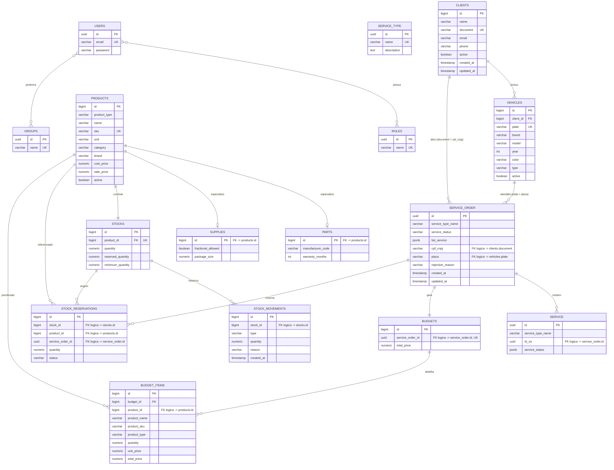

# os-management-database 

Infraestrutura do **banco de dados gerenciado** da plataforma OS Management
(FIAP SOAT — Tech Challenge Fase 3): provisiona o **Amazon RDS PostgreSQL**
via Terraform e é a fonte única de verdade do schema (DDL/DML) consumido
pela aplicação principal (`os-management`) e pela função serverless de
autenticação (`os-management-lambda`).

## Tecnologias

- **PostgreSQL 16** (Amazon RDS, `db.t3.micro`)
- **Terraform** (`~> 5.0` AWS provider) — provisionamento do RDS, security
  group e subnet group
- **GitHub Actions** — CI (`terraform fmt`/`validate`) e CD (deploy do RDS)
- Backend de estado remoto: **S3** com bloqueio nativo do estado

## Arquitetura deste repositório

```
┌──────────────────────────────────────────────────────────┐
│                        AWS us-east-1                       │
│                                                              │
│   os-management-k8s-terraform                                │
│   (VPC + subnets + node SG) ───────┐                          │
│                                     │ terraform_remote_state   │
│                                     ▼                          │
│                        os-management-database                 │
│                        ┌─────────────────────────┐             │
│                        │  Security Group (RDS)    │             │
│                        │  ingress 5432 ← node SG  │             │
│                        │            │              │             │
│                        │            ▼              │             │
│                        │  RDS PostgreSQL 16       │             │
│                        │  db.t3.micro             │             │
│                        │  (aurora_jdbc_url output)│             │
│                        └─────────────────────────┘             │
└──────────────────────────────────────────────────────────┘
                │ aurora_jdbc_url → segredo DB_URL_<ENV>
                ▼
   consumido por: os-management (app) e os-management-lambda (issuer)
```

O RDS **não é acessível publicamente** — o Security Group libera a porta
5432 apenas para o `node_security_group_id` do EKS (lido via
`terraform_remote_state` do `os-management-k8s-terraform`), garantindo que
tanto os pods da aplicação quanto a Lambda (que roda na mesma VPC) alcancem
o banco sem expor a porta à internet.

## Modelagem do Banco de Dados

### Diagrama ER



> Diagrama gerado a partir do schema real em [`scripts/ddl.sql`](scripts/ddl.sql).
> Relacionamentos marcados como **"FK lógica"** existem no domínio e nas
> queries da aplicação, mas **não têm constraint de FK no banco hoje** — ver
> [Ajustes no Modelo Relacional](#ajustes-no-modelo-relacional-proposto) abaixo.

### Explicação dos Relacionamentos

| Relacionamento | Cardinalidade | Observação |
|---|---|---|
| `clients` → `vehicles` | 1:N | Um cliente pode ter vários veículos; FK real (`fk_vehicles_clients`) |
| `clients` → `service_order` | 1:N | Via `service_order.cpf_cnpj = clients.document`; **sem FK declarada** — o backend valida a existência do cliente na camada de aplicação |
| `vehicles` → `service_order` | 1:N | Via `service_order.placa = vehicles.plate`; mesma situação — validado na aplicação |
| `service_order` → `service` | 1:N | Serviços internos da OS (diagnóstico, execução); vinculados por `service.id_os` |
| `service_order` → `budgets` | 1:1 | Um orçamento por OS (`budgets.service_order_id` é `UNIQUE`) |
| `budgets` → `budget_items` | 1:N | Itens do orçamento; única FK declarada dessa cadeia (`budget_items.budget_id`) |
| `service_order` → `stock_reservations` | 1:N | Reservas de estoque vinculadas à OS (ver [Reserva de Estoque](../os-tech-documentation/02%20-%20Regras%20de%20Negocio/Reserva%20de%20Estoque.md)) |
| `products` → `parts` / `products` → `supplies` | 1:0..1 | **Table-per-subtype**: `parts`/`supplies` compartilham a PK de `products` (herança modelada como FK 1:1) |
| `products` → `stocks` | 1:1 | Um registro de estoque por produto (`stocks.product_id` é `UNIQUE`) |
| `stocks` → `stock_movements` | 1:N | Histórico imutável de entradas/saídas/reservas |
| `users` ↔ `roles` / `users` ↔ `groups` | N:N | Via tabelas de junção `user_roles` e `user_groups`, ambas com FK declarada e `ON DELETE CASCADE` |

## Justificativa da Escolha do Banco de Dados

A escolha do **PostgreSQL**, gerenciado como **Amazon RDS**, está formalizada
em [`os-management/docs/rfc/RFC-0002-escolha-banco-dados.md`](../os-management/docs/rfc/RFC-0002-escolha-banco-dados.md).
Resumo dos motivos:

1. O domínio é fortemente relacional (clientes, veículos, OS, estoque,
   orçamento) com necessidade real de transações ACID — ex.: a reserva de
   estoque é atômica ("tudo ou nada").
2. Campos semiestruturados (`service_order.list_service`,
   `service.service_status`) usam `JSONB` nativo do Postgres, evitando
   tabelas adicionais para dados que variam em forma.
3. Continuidade com fases anteriores do projeto (mesmo dialeto SQL, mesmos
   testes de integração via Testcontainers).
4. Custo coberto pelo free tier do AWS Academy Learner Lab.

## Ajustes no Modelo Relacional (Proposto)

Analisando o schema atual (`scripts/ddl.sql`), identificamos relacionamentos
que hoje são **aplicados apenas na camada de aplicação** (Java/JPA), sem
constraint correspondente no banco. Isso funciona porque a aplicação é a
única escritora do schema, mas abre espaço para inconsistência caso um
script manual ou uma nova integração grave direto no banco sem passar pelas
regras de domínio. Como ajuste formal de consistência e performance,
propomos em [`scripts/ddl-improvements.sql`](scripts/ddl-improvements.sql):

1. **Chaves estrangeiras ausentes** — `stocks.product_id`,
   `stock_movements.stock_id`, `stock_reservations.{stock_id,product_id,service_order_id}`,
   `budgets.service_order_id`, `budget_items.product_id`, `service.id_os`.
   Garantem que uma reserva, movimentação ou item de orçamento nunca
   referencie um produto/estoque/OS inexistente.
2. **Índices em colunas de busca frequente** — `service_order.cpf_cnpj`
   (usado por `GET /order/document/{cpfCnpj}`) e `service_order.placa`
   não têm índice hoje, apesar de serem usados diretamente em `WHERE`;
   sem índice, essas consultas fazem *sequential scan* à medida que o
   volume de OS cresce com múltiplas unidades da oficina.
3. **Constraints de domínio (`CHECK`)** — `service_order.service_status` e
   `stock_reservations.status` são `VARCHAR` livre hoje; restringir aos
   valores válidos (`RECEBIDA`, `EM_DIAGNOSTICO`, ..., `RECUSADA` /
   `ACTIVE`, `CONFIRMED`, `RELEASED`) barra no banco um valor inválido que,
   hoje, só é barrado pela máquina de estados em Java.

> **Importante:** o script de ajustes é aditivo e não foi aplicado
> automaticamente ao schema em produção — antes de rodá-lo em um ambiente
> com dados reais, é preciso validar que não existem linhas órfãs (ex.: uma
> `stock_reservation` apontando para um `product_id` já removido), o que
> faria a criação da FK falhar. Rode a validação incluída no topo do script
> antes do `ALTER TABLE`.

## Estado do Terraform

O deploy executado pelo GitHub Actions utiliza um backend S3 com bloqueio
nativo do estado.

Antes do primeiro deploy:

1. Crie um bucket S3 na região `us-east-1`.
2. Configure o segredo `TF_STATE_BUCKET` no repositório com o nome do bucket.
3. Garanta que as credenciais da AWS tenham permissão para acessar o bucket
   e criar ou atualizar os recursos RDS e EC2.

Recursos criados por execuções anteriores são importados automaticamente
quando existem na AWS, mas ainda não estão registrados no estado remoto do
Terraform.

## Credenciais do banco

Configure os secrets `DB_USERNAME` e `DB_PASSWORD` no GitHub Actions. O
usuário não pode ser `postgres`, pois esse nome é reservado pelo RDS
PostgreSQL. Use, por exemplo, `dbadmin`.

## Deploy

```bash
cd terraform
cp terraform.tfvars.example terraform.tfvars   # preencha os valores reais

terraform init \
  -backend-config="bucket=<state-bucket>" \
  -backend-config="key=database/<env>/terraform.tfstate" \
  -backend-config="region=us-east-1"

terraform apply
```

Após o `apply`, copie o output `aurora_jdbc_url` para o segredo
`DB_URL_<ENV>` no repositório `os-management` (consumido pela aplicação) e,
se aplicável, no `os-management-lambda` (consumido pela função de
autenticação).

## Carga do schema

```bash
psql "$DATABASE_URL" -f scripts/ddl.sql
psql "$DATABASE_URL" -f scripts/dml.sql   # dados de exemplo (opcional)
```

## Deploy order

```
os-management-k8s-terraform → os-management-database → os-management-lambda → os-management-gateway → os-management
```

## Notas

- Lembrar de adicionar o usuário **`soat-architecture`** a este repositório
  (requisito de entrega do Tech Challenge).
